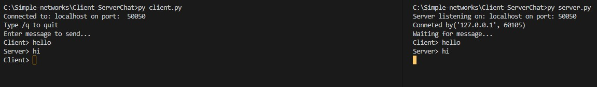
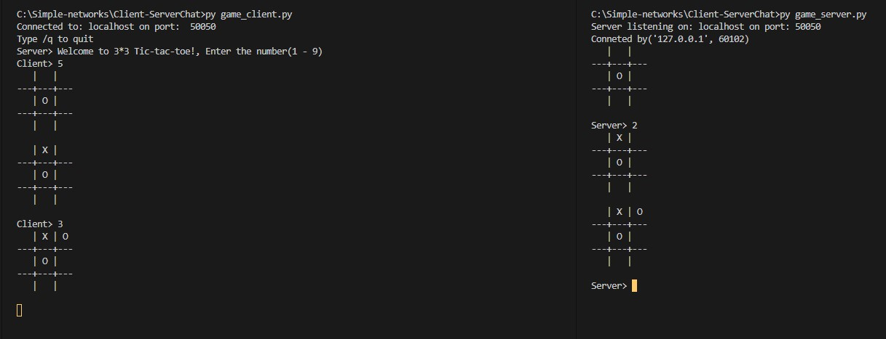

## Client/Server Chat

Write a simple client-server program using python sockets.

This chat client-server is fairly simple in design. The server doesn’t handle multiple
clients, and there is only one socket connection made.

## Command
```
python3 server.py
python3 client.py
```
## Screenshot


## Client/Server game

## Command
```
python3 game_server.py
python3 game_client.py
```
## Demo play
